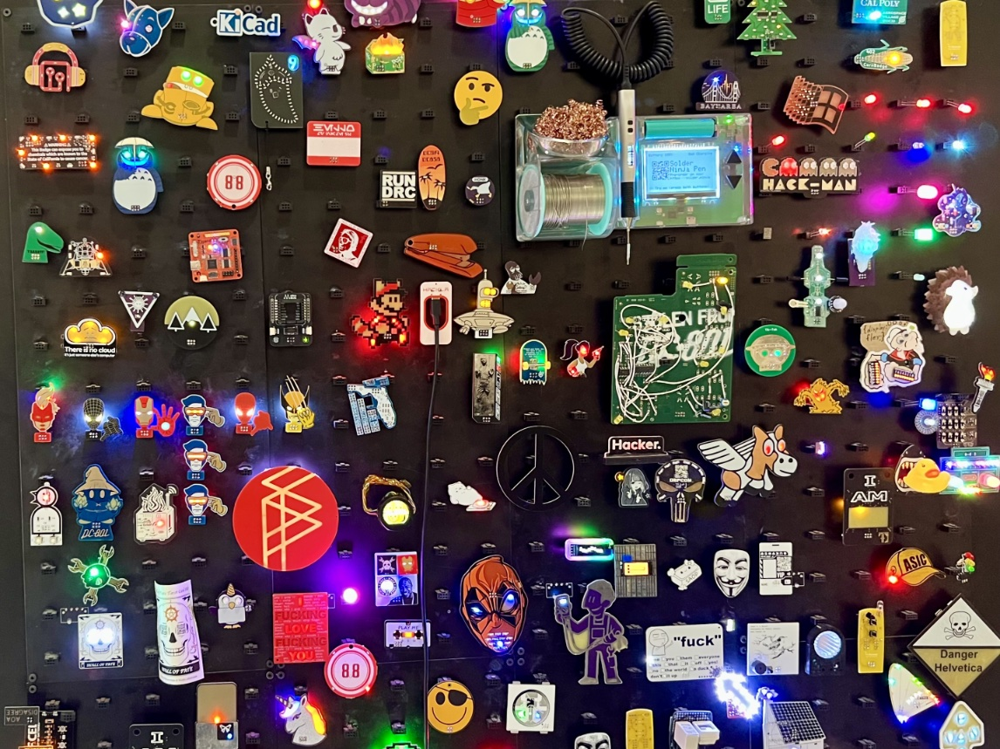
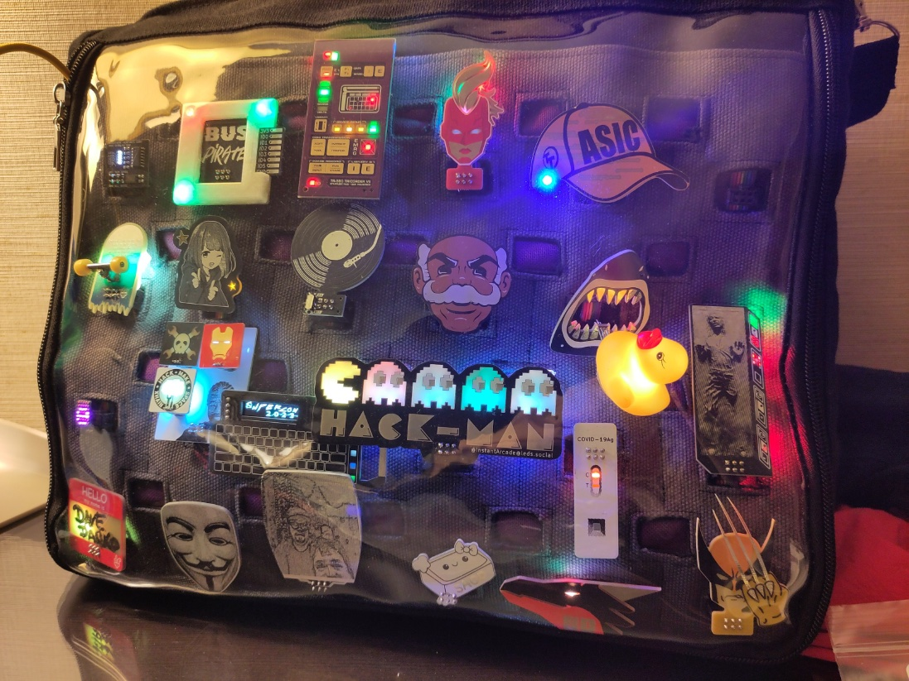

Welcome to the latest episode!  Paul and Tod discuss the recent Hackaday Supercon, including talks they enjoyed, 
the Supercon badge, and add-ons for the badge.

[Join our newsletter](https://buttondown.com/thebootloader)!  Find out what Tod and Paul are up to and they share links to stories that didn't make it into the podcast.

## Listen to the Show

<iframe width="100%" height="112" frameborder="0" scrolling="no" style="width: 100%; height: 112px;  overflow: hidden;" src="https://www.circuitpythonshow.com/@thebootloader/episodes/supercon-2024/embed/dark"></iframe>
## Show Notes

### Hackaday Supercon

Hackaday Superconference ("Supercon") is a 3-day conference that happens every year in Pasadena around the end of October at the Supplyframe DesignLab and its neighbor, the LA College of Music. About 500 people get together to hear a collection of talks on two stages from the Hackaday or larger tech nerd community.

Supercon is now in it’s eighth year. How long has Tod been going to Supercon?

- I've been every year except for the very first one up in San Francisco and the offshoot ones they have in Europe. I'm a big fan of [Hackaday](https://hackaday.com/), having been reading it since 2004. My wife Carlyn and I co-founded [CrashSpace](https://blog.crashspace.org/), a Los Angeles hackerspace that's going on its 15th year! (btw, if you're in SoCal on Dec 7, come by CrashSpace for its [CRASH Art Show and 15 year celebration](https://blog.crashspace.org/2024/11/crash-space-art-show-retrofuturespective/))
When Supplyframe bought Hackaday, they invited us to come by to help bring about a "Hackaday Hackerspace" and that turned into the DesignLab, a much nicer and cleaner space than most hackerspaces and much more usable for conferences.  And I did a [DesignLab Residency in 2017](https://hackaday.io/project/80-supplyframe-design-lab). Suffice to say, I'm a big fan of Hackaday and the DesignLab, and my thoughts are colored by now 20 years of being in the Hackaday community.

What’s the biggest thing that’s changed over that period?

- It's surprisingly consistent. That's partly due to the consistency of venue. I think it's more crowded now than when it started. The consistency is strange: I see friends there I only really interact with online because they live in New England or Germany and we're able to pick up right where we left off, like it's just another day and not been a whole year. As for conference content, they've struggled with the perennial tech world issue of having a bunch of old white guys like me on stage, but this year it feels like they've made strides towards fixing that.
I really look forward to Supercon every year and I'm glad they're working on making it more inclusive.

### About Supercon badges

Generally Supercon conference badges are PCBs with complex circuitry that is both visually
interesting and presents a sort of puzzle to the attendees. For some, the conference is an
entire weekend of hacking the badge: figuring it out and making it do something cool.

And almost none of them have spaces to write your name. We've evolved beyond badges being used for name identification.

Past badges have ranged from an FPGA that ran Linux, a 4-bit "retro" computer you programmed with switches, a virtual vectorscope, and a mesh networking chat keyboard.

Another aspect to these electronic badges has been add-ons, little extra circuits that just light up or add some functionality to the badge.  I personally think they started as a way to identify the badge holder as the badges themselves lost their ability to do this.

For the last six years or so these add-ons have been codified into a standard called "SAO"
-- [simple add-on](https://hackaday.io/project/175182-simple-add-ons-sao) (originally
[shitty add-on](https://hackaday.io/project/52950-shitty-add-ons) by Brian Benchoff).
It's a 6-pin connector that provides power, an I2C bus, and two pins of GPIO for whatever you want. Most add-ons just use power and light up in some cool way.

These SAO badge add-ons are generally pretty small: about 2" on a side.
The size and format allows for easy exploration of PCB art. A lot of experimenting
with PCB colors and LED back lighting happens here.

So given the rise of SAOs, this year's badge is primarily a platform to show off SAOs.
It has six SAO sockets on the front and a PicoW and batteries on the back.
It also came with a small collection of starter SAOs to display immediately.

But the real fun came as people gave out and traded SAOs all during the conference.

### Tod's 2024 Simple Add On

Majenta and Giovanni of the Supplyframe DesignLab (where SuperCon is held) contacted me in August, asking if I wanted make an SAO based off off my [touchwheel0](https://github.com/todbot/touchwheels) experiments.  It was a fun and quick process to scale down my Pico-based experiments to an ATtiny controller appropriate for an SAO.
Thankfully, my Arduino touch library worked well enough and the Arduino core for the ATtiny816 works great that I was able to get a prototype designed, routed, and fabbed in a week. Then we went through a couple design iterations to find the right combination of LED and chip packages to make it producable at scale.

The result is the [TouchwheelSAO](https://github.com/todbot/TouchwheelSAO) board that everyone got with their badge. In addition to being an ipod-like touch wheel, it's also got three addressable RGB LED backlights to indicate touch position.  Simple but seems to work!  The I2C protocol I desgined for it was meant to be as easy-as-possible for people to get touch data out of it or control its LEDs. Judging from the lack of questions about it and the many hacks people had that used it, I think it succeeded in that regard.

I wasn't convinced the captouch stuff would work reliably in the wild, battery-powered environment of the conference. But it seeme to!  In retrospect, I think using four interleaved touch pads instead of my usual three would've been better. It would've let us downgrade to a simple D-Pad if the analog touch angle calculations wasn't working reliably.

### [Giving Robotic Friends a Voice:  Jorvon Moss & Shawn Hymel](https://www.youtube.com/watch?v=uitqFyHD-QQ) by Jorvon Moss (Odd-Jayy) & Shawn Hymel (Paul #1)

* Jorvon has been working on robots for about 8 years.
* His latest robot, is Digit.  Must be wearable, good and comfy, unique design, and the ability to be upgraded.
  * Neat design - he used magnets in the robot and metal plates in his clothes to anchor Digit to him
* Wanted to integrate ChatGPT to be able to have a conversation with Digit, but that wouldn’t work as Jay needs to be mobile, like going to a conference like Supercon.
* The Raspberry Pi didn’t work, as the Lama 3 8B model from Meta fit, but it was a 30-60 second wait for an answer when talking to the large language model
* The Nvidia Jetson Orin Nano worked, but it’s much more expensive than a Pi at around $500
* Shawn explains how the wake word detection works with the LLM in a docker container and the text to speech in a separate docker container
* Working on prompt engineering - meaning it gives the robot personality.  Odd Jay has used Southern and passive agressive, saying things like “Bless your heart” which is not used in a nice way down South.

The talk and the demo was great - check out the video to see Digit in action and it even tells a joke.  Learn more at [Shawn's GitHub repository](https://github.com/ShawnHymel/hopper-chat)

### [Circuit Graver by Zach Fredin](https://hackaday.io/project/197182-the-circuit-graver) (Tod #1)

[post on Hackaday](https://hackaday.com/2024/11/06/rapid-prototyping-pcbs-with-the-circuit-graver/)

Zach gave a talk on this, but on the DesignLab stage. The DesignLab videos aren't streamed immediately to Youtube. We'll have to wait for Hackaday to upload it. It's worth a watch!

The Circuit Graver is essentially a computer-controlled drag-knife that can cut through copper-clad boards.
The result is a lot like CNC milled PCBs, but it's *much* faster.
And the cutting bit is not wee little drill bit that snaps when you look at it wrong.

Zach is also a friend. I've been seeing him make crazy circuits with just carving copper boards for many years. It's neat to see him extend this to computer control.

### Solving the Last Mile With 3D-printed Packaging by Christina Cyr (Paul #2)

[Christina Cyr - Solving the Last Mile With 3D-printed Packaging](https://www.youtube.com/watch?v=EC1JbWsBb1M)

* Christina Cyr is the CEO of dTOOR and The Cyrcle Phone
* Electrical engineer
* Dunnage - the packaging *inside* the box
  * Tissue paper
  * Plastic bag
  * Peanuts
  * Bubble wrap
  * Molded / folder cardboard (in most smartphones today)
* What can small manufacturers do?
  * Handmade cardboard molds
* PCB, Enclosure, Packaging
  * Could the enclosure and packaging made out of the same material and is recycled / biodegradable
  * Ended up going with biodegradable corn / rice based PLA material for 3D printers
* Challenges
  * Typical CAD software not used for designing packaging, but there are two specialty programs that do CAD design for packaging (ArtiosCAD and Kasemake)
  * Can’t just scale your product design to allow for packaging
  * Soft TPU is a pain
    * Can’t print soft TPU in the Bambu or Prusa, but could print on a Creality printer
  * Lesson learned: Could have shipped with bubble wrap that is made from 80% recycled nylon and is stronger than regular bubble wrap

### In Living Color: A New World of Full-Color PCBs" by Joe Long. (Tod #2)

Joe runs [HackerBoxes](https://hackerboxes.com/), a monthly subscription service for cool PCB-based nerd toys. He's been doing PCB art for a while and jumped in early on the full-color PCB services that both JLCPCB and PCBWay offer.  He went into his past attempts with doing full color on PCBS (stickers!) and his experiences with these new services.

### Microcontrollers Are Just Radios in Disguise - Charles Lohr

[Hackaday Supercon 2024 - Microcontrollers Are Just Radios in Disguise - Charles Lohr](https://www.youtube.com/watch?v=V57f5YltIwk)

In his intro, Charles shares he loves exploring what microcontrollers are capable of without wads of abstractions.

* Charles has a few rules to his hardware hacking, but the one to take away is using a microcontroller to do what the original chip designers expect to be impossible.
* Fan of the ATTiny85
  * Used it to transmit radio signals using GPIO
* Toolbox - cannot use the built-in radios, like wifi on the ESP8266
  * Digitally controlled oscillator
  * Frequency Modulation (FM)
  * Dithering
  * PLL for Frequency Multiplication
  * PWM for output
  * Harmonic output
* Wants to transmit NTSC video using these tools - much more complicated than sending FM
* Moving to the ESP 8266
  * No PWM is the challenge, but does have I2S, used for audio
  * Can play back bitstreams and broacasting NTSC black and white video just worked
  * Challenge was to get color video working and using a simulator, figured out the NTSC harmonics and reflections that allowed it
* Could they transmit LoRa on a microcontroller without a LoRa radio? Lora stands for long range - it sends radio packets at 900MHz
  * The ESP32-S2 didn’t work, but 2 chips di: the ch32v203 and esp8266 (not using the radio) using PWM
  * Wrote his own LoRa stack to work with LoRaWAN
  * Could send packets up to 1/2 a kilometer away
  * Eventually did get the ESP32-S2 working over 2.5 kilometers away
* Transmitting is the “easy” part, could he figure out receiving and figure out the timing?
  * Used the ch32v003 at $0.10 each
  * Figured it out, and had to figure out why is it working and why is it so weak
  * Could pick up the signal at 500 feet without any radio hardware
  * Ended up using the ch32v203 to create the receiver as it was slightly faster and needed for tuning the AM frequency

### Favorite SAO(s) (Paul)

A few of Paul’s favorites:
* Etch SAO (tiny Etch-a-sketch)
* SAO Digital Multimeter (Best overall) by Thomas Plummer
* Instant Arcade’s Pac-man SAO (ineligible due to using last years badge) (SMD challenge winner)
* Steven, a Simon clone - which uses Todbot’s SAO!
* Wish I could have seen:
  * Turntable SAO
  * Marvel X-Men SAO

### Favorite SAO(s) (Tod)

  First, check out all the amazing [SAO contest submissions](https://hackaday.io/submissions/supercon-8-sao-contest/list) and this
  [hackaday.io SAO list by Dave Darko](https://hackaday.io/list/165860-simple-add-on-badges)

  The [winner of the Hackaday SAO contest](https://hackaday.com/2024/11/04/supercon-2024-badge-add-on-winners/) really won me over too.
  It's a [full digital multimeter by Thomas Flummer](https://hackaday.io/project/198892-sao-digital-multimeter). It looks like a tiny Fluke meter. It's got probes! And useful functions like I2C bus handling. And it's code is written in CircuitPython!
  It looks very well engineered and  I think will be mass-produced by Hackaday for future Hackaday conferences.

  Another one I really liked was the [Record Scratch SAO](https://hackaday.io/project/198458-record-scratch-sao) by Simen E. Sørensen.  It looks like a record, but is a captouch wheel kinda like my SAO.  When you move your finger across it, it makes record scratch noises and plays beats!  It does this because it's a full RP2040 system with enough flash memory to store a sample and some clever code to scrub around in it.

  A whole other category for me is favorite SAO that were given to me.  Of these, my favorite
  is the [TARS SAO](https://hackaday.io/project/198001-tars-sao) by Dave Darko. Dave is a very prolific SAO maker and you can learn a lot by looking at [his designs](https://hackaday.io/davedarko).  The TARS SAO has a full-color TFT display, a speaker, and its face is 6 touch pads. And its driven by a Waveshare RP2040 Zero board. He's got several apps for it and it's really fun to play with.

SAO collection courtesy [Dave Darko](https://chaos.social/@davedarko/113411311043186065)
